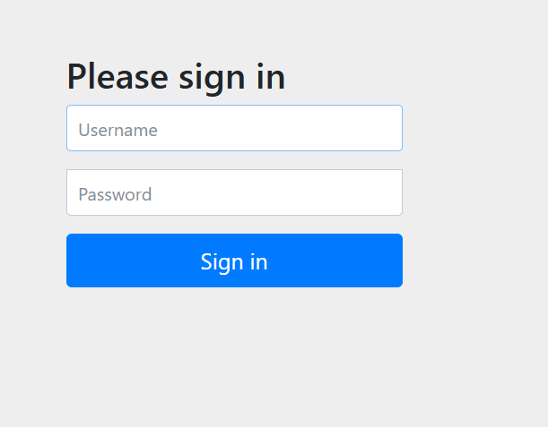
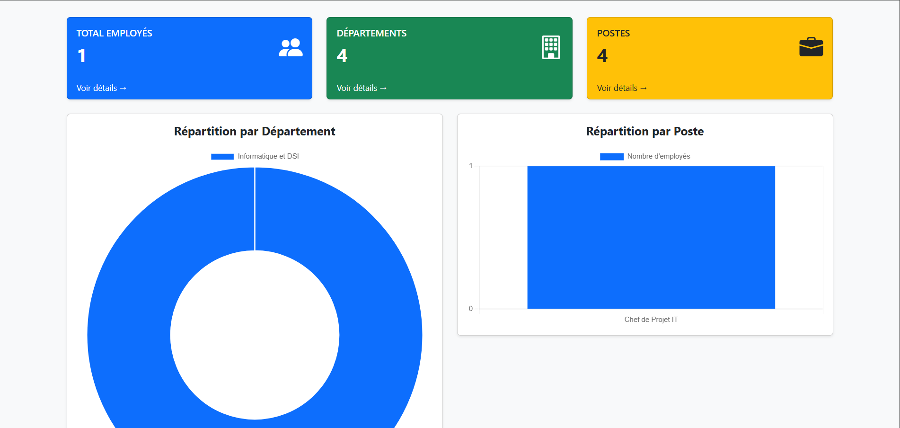
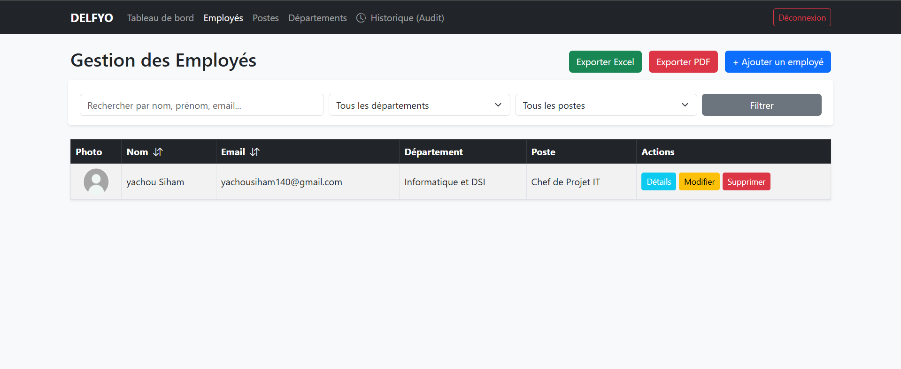
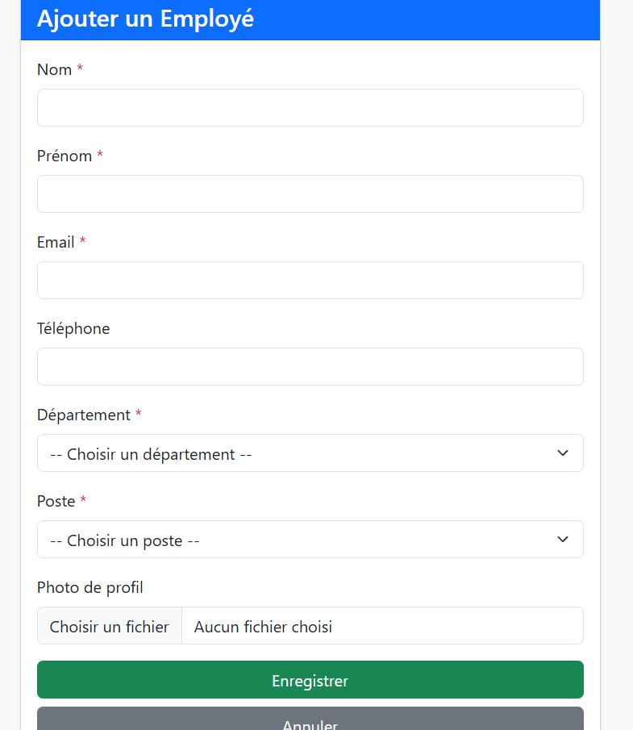
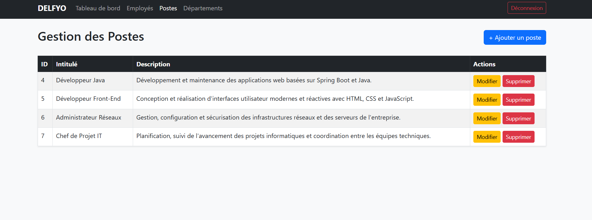
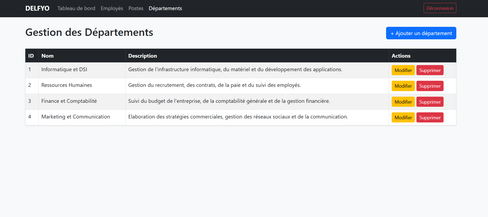
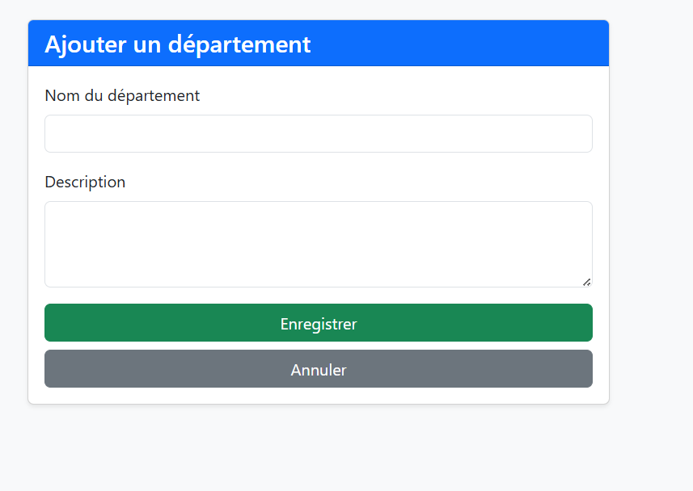
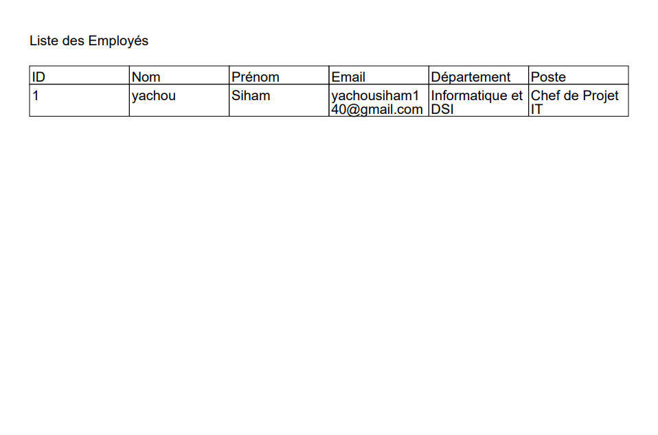
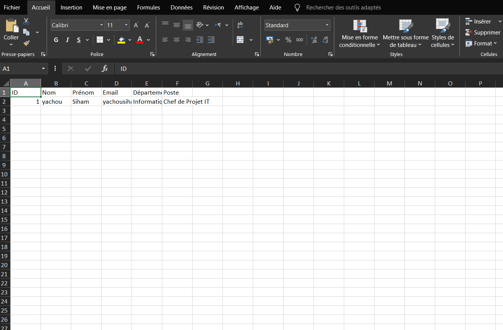

# 🚀 Employee Management System - DELFYO

Un système de gestion des employés moderne et complet développé avec **Spring Boot**, **Thymeleaf**, et **Bootstrap**.

---

## 📸 Aperçu de l'application (Screenshots)

### 🔑 Authentification

---

### 📊 Tableau de Bord (Dashboard)

---

### 👥 Gestion des Employés
#### Liste des Employés

#### Ajouter un Employé

---

### 💼 Gestion des Postes
#### Liste des Postes

#### Ajouter un Poste

---

### 🏢 Gestion des Départements
#### Liste des Départements

#### Ajouter un Département

---

### 📄 Exportation des Données
#### Exportation PDF

#### Exportation Excel
